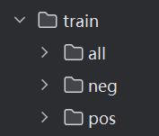
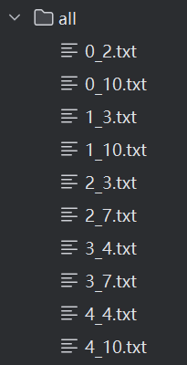
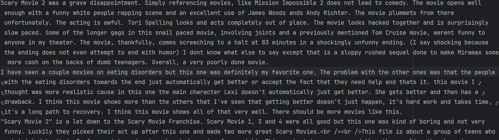
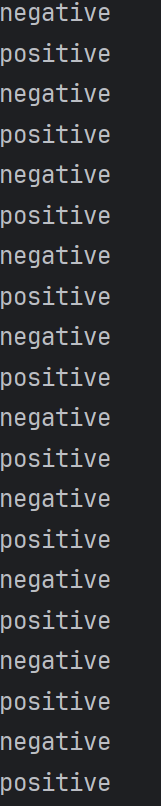
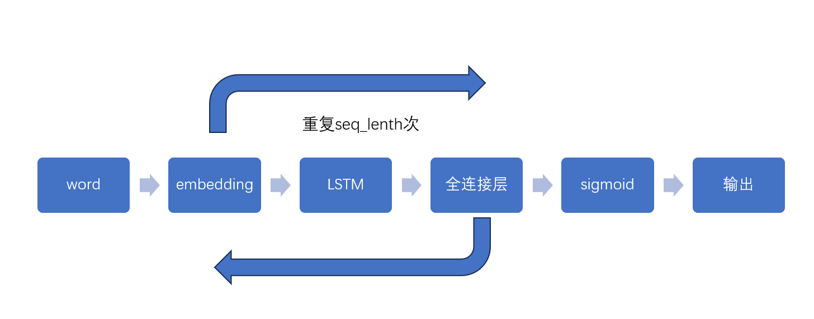
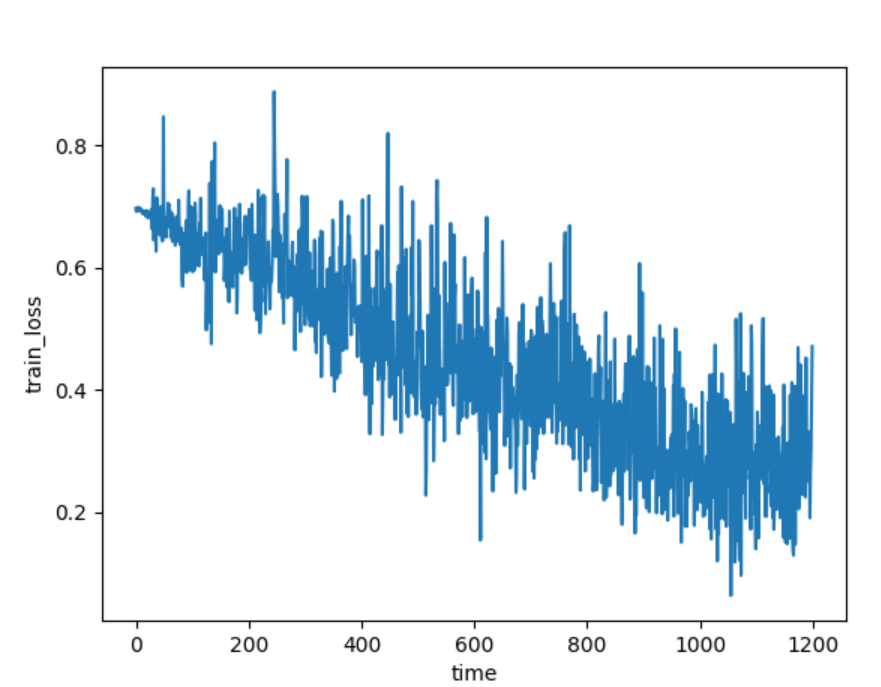
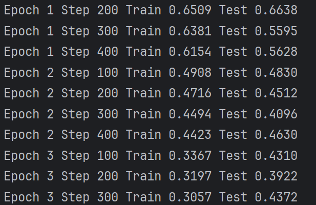

# IMDB情感分析

+ 你可以选择从[官网](https://ai.stanford.edu/~amaas/data/sentiment/)或者[stanfordnlp/imdb · Datasets at Hugging Face](https://huggingface.co/datasets/stanfordnlp/imdb)下载数据集。
+ 由于文本的离散特性，往往需要先利用一些库对文本进行tokenize
+ 根据tokenize之后的token得到对应的word embedding
+ 从word embedding开始接入常规的模型训练过程
+ 使用基本的textcnn、lstm实现，准确率不做要求


## 数据预处理部分

### 文本处理

首先，我从官网下载了数据集。大致长这样。我把neg和pos里面的所有txt文件放进了all里面。他里面的txt文件都是一段评论，首先我们要把这个评论进行如下操作。

	1. 去标点符号
	1. 把所有txt文件放进一个文件里面





```python
def merge_text_files(input_folder, output_file):
    with open(output_file, 'w', encoding='utf-8') as outfile:
        for filename in os.listdir(input_folder):
            if filename.endswith('.txt'):
                file_path = os.path.join(input_folder, filename)
                with open(file_path, 'r', encoding='utf-8') as infile:
                    content = infile.read().strip()  # 读取内容并去掉前后空白
                    outfile.write(content + '\n')     # 写入到输出文件，后面加换行符

# 示例使用
input_folder = 'aclImdb_v1/aclImdb/train/all'   
output_file = 'data/reviews_output.txt'      

merge_text_files(input_folder, output_file)
```

通过以上代码即可生成一个文件，里面存着所有txt文件，就像这样



而对于标签，因为评论合并之后是一条正向一条负向这样排列的，所以我们可以直接生成一个这样的文件



我们现在要把生成出来的总评论文件转换成一个二维列表，每行都是一条评论。除此之外，还需要生成一个单词对应数字的字典，再把刚刚列表里面的单词转换成数字，这样才可以输入我们的网络。我们需要进行以下步骤

1. 删除标点符号

2. 存入列表，按换行符分割

3. 生成字典

4. 按照字典给单词赋值

	```python
	# 按照punctuation里面的标点符号，删除review里面的标点符号
	reviews = reviews.lower()
	all_reviews = ''.join([c for c in reviews if c not in punctuation])
	
	reviews_split = all_reviews.split('\n')
	all_reviews = ' '.join(reviews_split)
	
	# 删除标点符号之后，按照空格对其进行分割
	words_reviews = all_reviews.split()
	
	# 计数单词出现的次数，然后对其排序
	word_counts = Counter(words_reviews)
	vocab = sorted(word_counts, key=word_counts.get, reverse=True)
	
	# 排序之后给他一个对应的整数序号。生成一个字典存储
	reviews_vocab = {vocab: idx for idx, vocab in enumerate(vocab, 1)}
	
	# 把上面的数据集，即所有句子，按照上面生成的字典赋值
	last_reviews = []
	for review in reviews_split:
	    last_reviews.append([reviews_vocab[vocab] for vocab in review.split()])
	```

同样的，可以简单地对标签也做一下处理

```python
splitted_labels = labels.split("\n")
encoded_labels = np.array([
    1 if label == "positive" else 0 for label in splitted_labels
])
```

把评论对应字典转换成数字之后，因为每个评论的长度都不一样，我们还需要把它们补充到一样。这里seq_length取250

```python
# 填充序列，把所有评论都填充到seq_length
def text_padding(encoded_reviews, seq_length):
    reviews = []

    for review in encoded_reviews:
        if len(review) >= seq_length:  # 评论长度过长就截取给定长度前面的
            reviews.append(review[:seq_length])
        else:  # 评论过短就在前面加相应的0直到为给定的长度
            reviews.append([0] * (seq_length - len(review)) + review)

    return np.array(reviews)
```

### 建立数据集

```python
# 建立数据集
# 7:3建立训练和测试集
rat = 0.8
train_length = int(len(padded_reviews) * rat)

X_train = padded_reviews[:train_length]
y_train = last_label[:train_length]

X_test = padded_reviews[train_length:]
y_test = last_label[train_length:]

batch_size = 50
device = "cuda" if torch.cuda.is_available() else "cpu"
train_dataset = TensorDataset(torch.from_numpy(X_train).to(device), torch.from_numpy(y_train).to(device))
test_dataset = TensorDataset(torch.from_numpy(X_test).to(device), torch.from_numpy(y_test).to(device))


train_loader = DataLoader(train_dataset, batch_size=batch_size, shuffle=True)
test_loader = DataLoader(test_dataset, batch_size=batch_size, shuffle=True)
```

直接建立即可，使用gpu训练。

按8：2建立训练和测试集

## 模型定义

这里我们使用LSTM网络，最后输出是一个二分类，包括正向和反向。



```python
class Model(nn.Module):
    def __init__(self, vocab_size, embedding_size, hidden_size, output_size, num_layers):
        super(Model, self).__init__()
        # 输入：vocab_size -- embedding_dim -- hidden_dim -- output_dim
        # num_layers为循环层数
        self.hidden_dim = hidden_size
        self.num_layers = num_layers

        self.embedding = nn.Embedding(vocab_size, embedding_size)
		#lstm层droput取0.5
        self.lstm = nn.LSTM(input_size=embedding_size,
                            hidden_size=hidden_size,
                            num_layers=num_layers,
                            batch_first=True,
                            dropout=0.5,
                            bidirectional=False)

        # 全连接层+sigmoid
        self.fc = nn.Sequential(
            nn.Dropout(0.5),
            nn.Linear(hidden_size, output_size),
            nn.Sigmoid()
        )

    def forward(self, token, hidden):
        batch_size = token.size(0)

        # embedding层
        out = self.embedding(token.long())
        # lstm层
        out, hidden = self.lstm(out, hidden)
        # 改变形状
        out = out.contiguous().view(-1, self.hidden_dim)
        # 全连接层
        out = self.fc(out)
        # 把batch换到前面	在python中每个单词都会进行最后的sigmoid分类，但我们取最后一个当结果
        out = out.view(batch_size, -1)

        # 获取最后一次的结果
        out = out[:, -1]

        return out

    def init_hidden(self, batch_size):  # 初始化lstm层的记忆参数
        return (torch.zeros(self.num_layers, batch_size, self.hidden_dim).to(device),
                torch.zeros(self.num_layers, batch_size, self.hidden_dim).to(device))
```

## 训练

首先我们创建一个模型。隐藏层神经元256，lstm循环3层，输出400。
损失函数用binary cross entropy二进制交叉熵函数

```python
vocab_size = len(vocab) + 1
embedding_size = 400
hidden_size = 256
output_size = 1
num_layers = 3
epochs = 3

model = Model(vocab_size, embedding_size, hidden_size, output_size, num_layers).to(device)

# 损失函数采用二进制交叉熵函数
criterion = nn.BCELoss()
optimizer = torch.optim.Adam(model.parameters(), lr=0.001)
```

然后我们可以开始训练。我们先初始化lstm的记忆参数，全为零。然后就是常规的训练和测试，训练过程中使用了clip裁剪，防止梯度爆炸。

```python
for epoch in range(epochs):
    hidden = model.init_hidden(batch_size)  # 初始化lstm的记忆
    train_losses = []

    for i, (review, label) in enumerate(train_loader):
        model.train()   # 训练模式
        review, label = review.to(device), label.to(device)

        optimizer.zero_grad()   # 梯度清零
        hidden2 = tuple([h.data for h in hidden])   # 复制hidden
        output = model(review, hidden2)

        loss = criterion(output.squeeze(), label.float())
        loss.backward()
        # 梯度裁剪防止梯度爆炸
        nn.utils.clip_grad_norm_(model.parameters(), 5)
        # 优化
        optimizer.step()

        train_losses.append(loss.item())    # 记录

        if (i + 1) % 100 == 0:  # 测试
            test_h = model.init_hidden(batch_size)
            test_losses = []

            model.eval()

            for review, label in test_loader:
                review, label = review.to(device), label.to(device)
                test_h = tuple([h.data for h in test_h])
                output = model(review, test_h)
                test_loss = criterion(output.squeeze(), label.float())

                test_losses.append(test_loss.item())

            print("Epoch {} Step {} Train {:.4f} Test {:.4f}".
                  format(epoch + 1, i + 1, np.mean(train_losses), np.mean(test_losses)))
```

训练结果如下，epoch取3。可见训练集的损失函数一直在下降，而测试集在最后稍微有上升的趋势。如果把epoch改更大，那训练集的loss就会一直下降，但测试集的则会不断上升。




