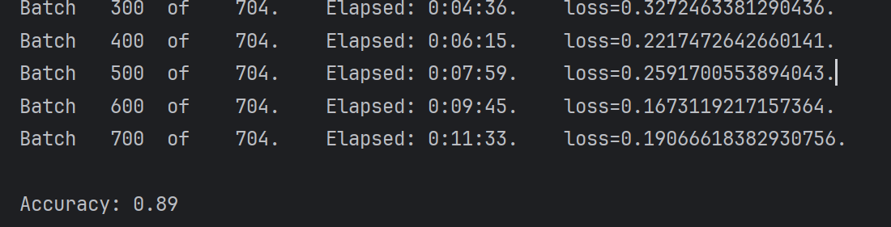

# Task2.基于Transformer的预训练模型

学习最基本的预训练模型，bert和gpt(你也可以选择学习其中的一个)

+ 查阅资料, 了解并掌握transformer模型原理([Transformer论文逐段精读【论文精读】_哔哩哔哩_bilibili](https://www.bilibili.com/video/BV1pu411o7BE/?spm_id_from=333.999.0.0))
+ 尝试手动实现bert或者gpt

+ 使用预训练好的bert/gpt以及它们对应的tokenizer进行finetune，并且**利用预训练模型实现上一个任务中的分类任务或者序列标注任务**(你也可以选择使用自己实现的bert并进行对比)

* 调用的库不做要求，强烈建议使用transformers库
* [transformers库官方文档](https://huggingface.co/docs/transformers/training) ，官方文本分类[代码参考](https://github.com/huggingface/transformers/blob/main/examples/pytorch/text-classification/)
* 比较bert和gpt的区别


## 使用预训练好的bert进行微调IMDB数据集。

1. 数据预处理

	因为我们做的是分类任务，所以我使用了BertForSequenceClassification模型。首先从hugging face网站上下载这个模型，在这里进行它Tokenizer的加载。然后对上一个任务中弄好的两个数据集文件进行加载。

	```python
	device = "cuda" if torch.cuda.is_available() else "cpu"
	# 加载bert模型，使用BertForSequenceClassification模型
	tokenizer = AutoTokenizer.from_pretrained("./bert_tokenizer/")
	# 使用之前做好的文件。
	with open('E:/学习ppt和word/AI派/第二轮/task1/IMDB情感分析/data/reviews.txt', 'r', encoding='utf-8') as f:
	    sentences = f.read()
	
	with open('E:/学习ppt和word/AI派/第二轮/task1/IMDB情感分析/data/labels.txt', 'r') as f:
	    labels = f.read()
	
	sentences = sentences.split('\n')
	labels = labels.split("\n")
	labels = np.array([
	    1 if label == "positive" else 0 for label in labels
	])
	labels = labels.tolist()
	```

	然后因为bert模型的要求，我们的输入长度需要一样，而且在句子开头加上[cls]结尾加上[sep]标志，对于填充的则用[pad]表示。
	此外，我们还需要生成注意力掩码，把填充的内容遮住。

	

	```python
	# input_ids是转换为id后的文本
	max_len = 128
	input_ids = [tokenizer.encode(sent, add_special_tokens=True, max_length=max_len, truncation=True) for sent in sentences]
	input_ids = pad_sequences(input_ids, maxlen=max_len, dtype="long",
	                          value=0, truncating="post", padding="post")
	
	# 生成注意力掩码，把填充的内容遮住
	attention_masks = []
	for sent in input_ids:
	    att_mask = [int(token_id > 0) for token_id in sent]
	    attention_masks.append(att_mask)
	```

	接下来，我们需要定义数据集和loader

	训练和测试集9：1。

	```python
	# 训练测试9:1
	train_inputs, test_inputs, train_labels, test_labels = train_test_split(input_ids, labels,
	                                                                        random_state=2024, test_size=0.1)
	# 对注意力掩码做相同操作
	train_masks, test_masks, _, _ = train_test_split(attention_masks, labels,
	                                                 random_state=2024, test_size=0.1)
	
	# 转为tensor
	train_inputs = torch.tensor(train_inputs)
	test_inputs = torch.tensor(test_inputs)
	train_labels = torch.tensor(train_labels)
	test_labels = torch.tensor(test_labels)
	train_masks = torch.tensor(train_masks)
	test_masks = torch.tensor(test_masks)
	
	# 创建数据集和loder
	batch_size = 32
	
	# 训练集的数据集
	train_data = TensorDataset(train_inputs, train_masks, train_labels)
	train_sampler = RandomSampler(train_data)  # 数据随机采样
	train_dataloader = DataLoader(train_data, sampler=train_sampler, batch_size=batch_size)
	
	# 测试集的数据集
	test_data = TensorDataset(test_inputs, test_masks, test_labels)
	test_sampler = SequentialSampler(test_data)  # 按顺序采样
	test_dataloader = DataLoader(test_data, sampler=test_sampler, batch_size=batch_size)
	```

	其中对训练集和测试集的采样顺序会不一样。原因如下

	在训练集和验证集的数据加载过程中,使用不同的采样方式是有特定的考虑因素的:

	训练集采用随机采样(RandomSampler):
	目的是为了增加模型训练的多样性和泛化能力。
	随机采样可以打乱训练数据的顺序,避免模型在训练过程中过拟合某些特定顺序的数据。
	这有助于模型学习到更加稳健和泛化性强的特征表示。
	验证集采用顺序采样(SequentialSampler):
	验证集的目的是评估模型在训练外数据上的性能。
	使用顺序采样可以确保验证集的数据顺序是固定的,这样可以更好地比较不同训练轮次或不同模型的性能指标。
	如果采用随机采样,每次验证时得到的指标可能会有一定的波动,不利于模型选择和超参数调优。

	

2. 模型定义

	模型直接使用BertForSequenceClassification模型，在这之后直接加一个线性层进行分类

	```python
	# 获取与训练好的bert分类模型，分两类
	model = BertForSequenceClassification.from_pretrained(
	    "bert-base-uncased",
	    num_labels=2,
	    output_attentions=False,
	    output_hidden_states=False,
	)
	
	# 同样使用gpu训练
	model.cuda()
	
	optimizer = torch.optim.AdamW(model.parameters(), lr=2e-5, eps=1e-8)
	```

	优化函数使用Adamw

	AdamW和Adam唯一的区别，就是weight decay的加入方式。

	在Adam当中，weight decay是直接加入到梯度当中：

	

	其中是当前step的梯度，是上一个step中的模型权重，是正则化系数。

	而在AdamW中，正则化变成了：

	

	其中是学习率。

	所以AdamW的思路特别简单：反正正则化系数加进梯度之后最终也要在权重上进行更新，那为什么还需要加进梯度去呢？因此，AdamW直接在权重上进行衰减，在收敛速度上也能领先于Adam。

3. 训练

	```python
	epoch = 2
	train_loss = []
	train_plt_loss = []
	test_loss = []
	for epoch_i in range(epochs):
	    print("Epoch:", epoch_i)
	    # 记录当前时间
	    t0 = time.time()
	    total_loss = 0
	    model.train()
	    for step, batch in enumerate(train_dataloader):
	
	        if step % 100 == 0 and not step == 0:
	            elapsed = format_time(time.time() - t0)
	            print('Batch {:>5,}  of  {:>5,}.    Elapsed: {:}.    loss={}.'.format(step, 								 len(train_dataloader), elapsed, train_loss[-1])                                         
	        if step % 100 == 0 and not step == 0:
	            train_plt_loss.append(train_loss[-1])
	        b_input_ids = batch[0].to(device)
	        b_input_mask = batch[1].to(device)
	        b_labels = batch[2].to(device)
	
	        model.zero_grad()
	        outputs = model(b_input_ids,
	                        token_type_ids=None,
	                        attention_mask=b_input_mask,
	                        labels=b_labels)
	
	        loss = outputs[0]
	        total_loss += loss.item()
	        train_loss.append(loss.item())
	        loss.backward()
	        torch.nn.utils.clip_grad_norm_(model.parameters(), 1.0)
	        optimizer.step()
	
	    print("")
	
	    t0 = time.time()
	
	    # 开始测试
	    model.eval()
	    eval_loss, eval_accuracy = 0, 0
	    nb_eval_steps, nb_eval_examples = 0, 0
	
	    for batch in test_dataloader:
	        b_input_ids = batch[0].to(device)
	        b_input_mask = batch[1].to(device)
	        b_labels = batch[2].to(device)
	
	        with torch.no_grad():
	            outputs = model(b_input_ids,
	                            token_type_ids=None,
	                            attention_mask=b_input_mask)
	        logits = outputs[0]
	
	        logits = logits.detach().cpu().numpy()
	        label_ids = b_labels.to('cpu').numpy()
	
	        tmp_eval_accuracy = cal_accuracy(logits, label_ids)
	        eval_accuracy += tmp_eval_accuracy
	
	        nb_eval_steps += 1
	
	    print("  Accuracy: {0:.2f}".format(eval_accuracy / nb_eval_steps))
	```

	非常常规的训练和测试过程。其中计算时间和正确率的函数如下

	```python
	def cal_accuracy(preds, labels):
	    pred_flat = np.argmax(preds, axis=1).flatten()
	    labels_flat = labels.flatten()
	    return np.sum(pred_flat == labels_flat) / len(labels_flat)
	
	
	def format_time(elapsed):
	    # Round to the nearest second.
	    elapsed_rounded = int(round(elapsed))
	
	    # Format as hh:mm:ss
	    return str(datetime.timedelta(seconds=elapsed_rounded))
	```

	

4. 结果

最后结果大致像这样





