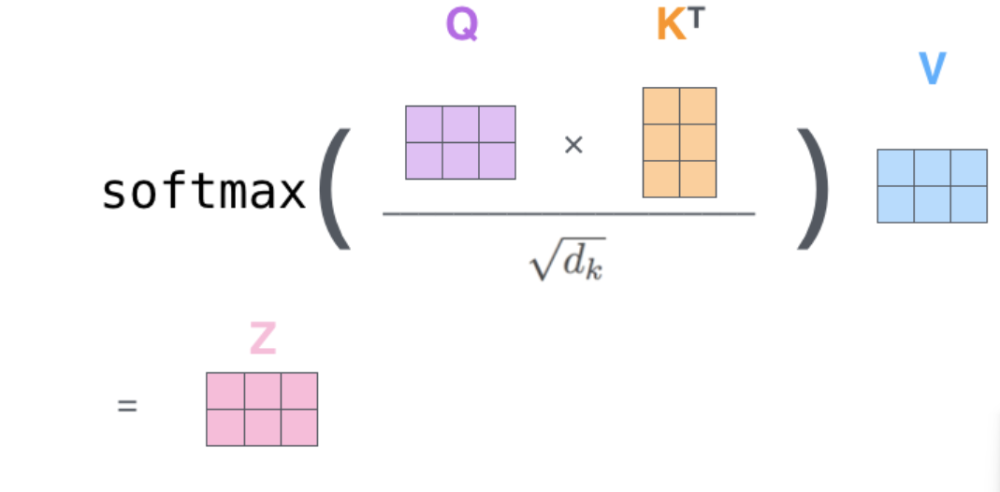

# pytorch 实现bert

参考：[wmathor/nlp-tutorial: Natural Language Processing Tutorial for Deep Learning Researchers (github.com)](https://github.com/wmathor/nlp-tutorial)

## 数据集和预处理

超参数定义如下

```python
# BERT Parameters
maxlen = 30		# 句子最大长度（两个合并之后）
batch_size = 6
max_pred = 5  # 每个句子最大的mask数量
n_layers = 6  # 编码器层数量
n_heads = 12  # 有几个头
d_model = 768
d_ff = 768 * 4  # 4*d_model, FeedForward dimension
d_k = d_v = 64  # dimension of K(=Q), V
n_segments = 2  # 输入由几句话组成
```

创建数据集

```python
text = (
    'Hello, how are you? I am Romeo.\n'  # R
    'Hello, Romeo My name is Juliet. Nice to meet you.\n'  # J
    'Nice meet you too. How are you today?\n'  # R
    'Great. My baseball team won the competition.\n'  # J
    'Oh Congratulations, Juliet\n'  # R
    'Thank you Romeo\n'  # J
    'Where are you going today?\n'  # R
    'I am going shopping. What about you?\n'  # J
    'I am going to visit my grandmother. she is not very well'  # R
)
sentences = re.sub("[.,!?\\-]", '', text.lower()).split('\n')  # filter '.', ',', '?', '!'
word_list = list(set(" ".join(sentences).split()))  # ['hello', 'how', 'are', 'you',...]
word2idx = {'[PAD]': 0, '[CLS]': 1, '[SEP]': 2, '[MASK]': 3}
for i, w in enumerate(word_list):
    word2idx[w] = i + 4
idx2word = {i: w for i, w in enumerate(word2idx)}
vocab_size = len(word2idx)

token_list = list()
for sentence in sentences:
    arr = [word2idx[s] for s in sentence.split()]
    token_list.append(arr)
```

随便打一段话进去，不用在意数据集。预处理部分参考bert原论文或者笔记：

在bert中句子首先要进行拼接，把两段句子拼在一起，然后进行以下处理
80%的单词是采用[mask]，my dog is hairy → my dog is [MASK]
10%的单词是随机取一个词来代替mask的词，my dog is hairy -> my dog is apple
10%的单词保持不变，my dog is hairy -> my dog is hairy

替换的同时还要保存原来的序号和单词作为监督数据。除了单词填空之外，bert还有个训练方法，就是预测两个句子是否上下文关系，我们要生成一半是（上下文）一半不是的数据集。因为我们的原始数据是一段话，所以直接判断他们序号是否相连即可，通过while来生成。先拼起来，再进行替换。完成这些之后，还需要把这些句子的长度填充成一样的，两个监督数据同样要这样操作。

除此之外，bert的输入还需要注意力掩码，这个直接把句子部分的句子1填0，句子2填1，剩余填0。

```python
def make_data():
    batch = []
    positive = negative = 0
    while positive != batch_size / 2 or negative != batch_size / 2:
        # 随机获取两个句子
        tokens_a_index, tokens_b_index = randrange(len(sentences)), randrange(
            len(sentences))  # sample random index in sentences
        tokens_a, tokens_b = token_list[tokens_a_index], token_list[tokens_b_index]
        # 把两个句子拼在一起，同时加上cls和sep
        input_ids = [word2idx['[CLS]']] + tokens_a + [word2idx['[SEP]']] + tokens_b + [word2idx['[SEP]']]
        # 弄个编码，0代表句子a，1代表句子b
        segment_ids = [0] * (1 + len(tokens_a) + 1) + [1] * (len(tokens_b) + 1)

        # MASK LM 把0.15的单词进行”mask“
        n_pred = min(max_pred, max(1, int(len(input_ids) * 0.15)))  # 15 % of tokens in one sentence
        # 表示inputs中需要注意的序号。（无cls和sep）
        cand_maked_pos = [i for i, token in enumerate(input_ids)
                          if token != word2idx['[CLS]'] and token != word2idx['[SEP]']]  # candidate masked position
        #  0.8概率生成mask遮住单词，0.1替换成其他错的单词，剩下的不用换
        shuffle(cand_maked_pos)  # 打乱
        masked_tokens, masked_pos = [], []
        for pos in cand_maked_pos[:n_pred]:  # 随机打乱之后把前0.15的单词进行生成mask或者替换或者不变
            masked_pos.append(pos)  # 遮住的编号
            masked_tokens.append(input_ids[pos])  # 遮住的单词编码
            if random() < 0.8:  # 80%
                input_ids[pos] = word2idx['[MASK]']  # make mask
            elif random() > 0.9:  # 10%
                index = randint(0, vocab_size - 1)  # random index in vocabulary
                while index < 4:  # can't involve 'CLS', 'SEP', 'PAD'
                    index = randint(0, vocab_size - 1)
                input_ids[pos] = index  # replace
    	# 填充
        n_pad = maxlen - len(input_ids)  # 要遮掩几个
        input_ids.extend([0] * n_pad)
        segment_ids.extend([0] * n_pad)

        # 预测用的也需要统一到最大，多余就填充
        if max_pred > n_pred:
            n_pad = max_pred - n_pred
            masked_tokens.extend([0] * n_pad)
            masked_pos.extend([0] * n_pad)

        # 生成一半正确和错误的数据，判断他们两个序号是否相连。满足条件就加入batch中，直到batch里面有一半正确和错误。
        if tokens_a_index + 1 == tokens_b_index and positive < batch_size / 2:
            batch.append([input_ids, segment_ids, masked_tokens, masked_pos, True])  # IsNext
            positive += 1
        elif tokens_a_index + 1 != tokens_b_index and negative < batch_size / 2:
            batch.append([input_ids, segment_ids, masked_tokens, masked_pos, False])  # NotNext
            negative += 1
    return batch

# 生成batch，然后获得其中依次：数据集，句子划分，遮住的单词，遮住的序号，是否相连
# 然后转换成tensor类型
batch = make_data()
input_ids, segment_ids, masked_tokens, masked_pos, isNext = zip(*batch)
input_ids, segment_ids, masked_tokens, masked_pos, isNext = \
    torch.tensor(input_ids, dtype=torch.long), torch.tensor(segment_ids, dtype=torch.long), 			 torch.tensor(masked_tokens,  dtype=torch.long),\                                                           
        torch.tensor(masked_pos, dtype=torch.long), torch.tensor(isNext, dtype=torch.long)
```

准备好5个数据并生成了tensor之后就可以生成dataloader了，直接用pytorch的模板即可

```python
class MyDataSet(Data.Dataset):
    def __init__(self, input_ids, segment_ids, masked_tokens, masked_pos, isNext):
        self.input_ids = input_ids
        self.segment_ids = segment_ids
        self.masked_tokens = masked_tokens
        self.masked_pos = masked_pos
        self.isNext = isNext

    def __len__(self):
        return len(self.input_ids)

    def __getitem__(self, idx):
        return self.input_ids[idx], self.segment_ids[idx], self.masked_tokens[idx], self.masked_pos[idx], self.isNext[
            idx]


#  生成数据集即可
loader = Data.DataLoader(MyDataSet(input_ids, segment_ids, masked_tokens, masked_pos, isNext), batch_size, True)
```

## 模型定义

### 多头注意力

ScaledDotProductAttention函数负责计算如下的公式。并在MultiHeadAttention中被调用。



```python
class ScaledDotProductAttention(nn.Module):
    def __init__(self):
        super(ScaledDotProductAttention, self).__init__()

    def forward(self, Q, K, V, attn_mask):
        # q和k.T相乘除以根号d_k
        scores = torch.matmul(Q, K.transpose(-1, -2)) / np.sqrt(d_k)  # scores : [batch_size, n_heads, seq_len, seq_len]
        # 乘完之后要填充然后才可以跟v相乘。
        scores.masked_fill_(attn_mask, -1e9)  
        attn = nn.Softmax(dim=-1)(scores)
        context = torch.matmul(attn, V)
        return context


class MultiHeadAttention(nn.Module):
    def __init__(self):
        super(MultiHeadAttention, self).__init__()
        self.W_Q = nn.Linear(d_model, d_k * n_heads)
        self.W_K = nn.Linear(d_model, d_k * n_heads)
        self.W_V = nn.Linear(d_model, d_v * n_heads)

    def forward(self, Q, K, V, attn_mask):
        # q: [batch_size, seq_len, d_model], k: [batch_size, seq_len, d_model], v: [batch_size, seq_len, d_model]
        residual, batch_size = Q, Q.size(0)		# 获得残差连接和batchsize
        # (B, S, D) -proj-> (B, S, D) -split-> (B, S, H, W) -trans-> (B, H, S, W)
        # view：维度重构     transpose：调换1维和2维
        q_s = self.W_Q(Q).view(batch_size, -1, n_heads, d_k).transpose(1, 2)  # q_s: [batch_size, n_heads, seq_len, d_k]
        k_s = self.W_K(K).view(batch_size, -1, n_heads, d_k).transpose(1, 2)  # k_s: [batch_size, n_heads, seq_len, d_k]
        v_s = self.W_V(V).view(batch_size, -1, n_heads, d_v).transpose(1, 2)  # v_s: [batch_size, n_heads, seq_len, d_v]
        # unsqueeze：在1处加一个维度    repeat：每个维度复制的次数，此处即把他们复制n_heads次
        attn_mask = attn_mask.unsqueeze(1).repeat(1, n_heads, 1,
                                                  1)  # attn_mask : [batch_size, n_heads, seq_len, seq_len]

        # context: [batch_size, n_heads, seq_len, d_v], attn: [batch_size, n_heads, seq_len, seq_len]
        context = ScaledDotProductAttention()(q_s, k_s, v_s, attn_mask)  # 计算公式
        context = context.transpose(1, 2).contiguous().view(batch_size, -1,  # contiguous把张量变连续，然后才能用view
                                                            n_heads * d_v)  # context: [batch_size, seq_len, n_heads, d_v]
        output = nn.Linear(n_heads * d_v, d_model)(context)
        # 加上残差连接之后LayerNorm一下 类实例化之后直接调用
        return nn.LayerNorm(d_model)(output + residual)  # output: [batch_size, seq_len, d_model]
```

多头注意力里面，首先记录一下输入，后面作残差连接。然后计算KQV，复制12份。然后进行KQV的计算，算出来再转换一下维度，变成12头，同时把注意力attn_mask也弄成12头的。进行上述的ScaledDotProductAttention，套个公式，出来之后再转变一下维度让他可以进行最后的线性层和Norm层。

### Encoder

Encoder分为上面的多头注意力和线性层

线性层就直接两个线性，然后用bert里面的激活函数gelu。线性–gelu–线性

```python
def gelu(x):
    return x * 0.5 * (1.0 + torch.erf(x / math.sqrt(2.0)))


class PoswiseFeedForwardNet(nn.Module):
    def __init__(self):
        super(PoswiseFeedForwardNet, self).__init__()
        self.fc1 = nn.Linear(d_model, d_ff)
        self.fc2 = nn.Linear(d_ff, d_model)

    def forward(self, x):
        # (batch_size, seq_len, d_model) -> (batch_size, seq_len, d_ff) -> (batch_size, seq_len, d_model)
        return self.fc2(gelu(self.fc1(x)))


class EncoderLayer(nn.Module):
    def __init__(self):
        super(EncoderLayer, self).__init__()
        self.enc_self_attn = MultiHeadAttention()
        self.pos_ffn = PoswiseFeedForwardNet()

    def forward(self, enc_inputs, enc_self_attn_mask):
        enc_outputs = self.enc_self_attn(enc_inputs, enc_inputs, enc_inputs,
                                         enc_self_attn_mask)  # enc_inputs to same Q,K,V
        enc_outputs = self.pos_ffn(enc_outputs)  # enc_outputs: [batch_size, seq_len, d_model]
        return enc_outputs
```

直接套就行。

### Emedding

bert的Emedding有三个，分别是token embedding，position embedding和segment embedding。分别计算这三个，然后进行相加即可，最后同样用LayerNorm正则化。

```python
class Embedding(nn.Module):
    def __init__(self):
        super(Embedding, self).__init__()
        self.tok_embed = nn.Embedding(vocab_size, d_model)  # token embedding   词嵌入
        self.pos_embed = nn.Embedding(maxlen, d_model)  # position embedding    位置嵌入
        self.seg_embed = nn.Embedding(n_segments, d_model)  # segment(token type) embedding     句子嵌入
        self.norm = nn.LayerNorm(d_model)

    def forward(self, x, seg):
        seq_len = x.size(1)
        pos = torch.arange(seq_len, dtype=torch.long)	# 位置
        pos = pos.unsqueeze(0).expand_as(x)  # [seq_len] -> [batch_size, seq_len]
        embedding = self.tok_embed(x) + self.pos_embed(pos) + self.seg_embed(seg)
        return self.norm(embedding)
```


### BERT

1. 进行Embedding，然后生成注意力掩码，把填充的遮住。
2. 经过6个Encoder
3. 因为要进行两个任务（判断是否上下文和单词预测），所以分开两边
	1. 经过线性，Dropout，Tanh，分类器，判断是否上下文。
	2. 获得经过网络之后对应被mask了的单词元素，让其进行线性，gelu，再进行预测即可。

```python
class BERT(nn.Module):
    def __init__(self):
        super(BERT, self).__init__()
        self.embedding = Embedding()    # Embedding
        self.layers = nn.ModuleList([EncoderLayer() for _ in range(n_layers)])  # 6个Encoder
        self.fc = nn.Sequential(    # 线性--Dropout--Tanh 用于判断是否上下文
            nn.Linear(d_model, d_model),
            nn.Dropout(0.5),
            nn.Tanh(),
        )
        self.classifier = nn.Linear(d_model, 2) # 分类器，用于判断是否上下文
        self.linear = nn.Linear(d_model, d_model)   # 用于预测mask
        self.activ2 = gelu
        # fc2 is shared with embedding layer
        embed_weight = self.embedding.tok_embed.weight
        self.fc2 = nn.Linear(d_model, vocab_size, bias=False)   # 用于预测单词
        self.fc2.weight = embed_weight  # 所以他的权重直接用词嵌入的权重

    def forward(self, input_ids, segment_ids, masked_pos):
        output = self.embedding(input_ids, segment_ids)  # [bach_size, seq_len, d_model]
        enc_self_attn_mask = get_attn_pad_mask(input_ids, input_ids)  # [batch_size, maxlen, maxlen]
        for layer in self.layers:
            # output: [batch_size, max_len, d_model]
            output = layer(output, enc_self_attn_mask)
        # 判断是否上下文
        h_pooled = self.fc(output[:, 0])  # [batch_size, d_model]	
        logits_clsf = self.classifier(h_pooled)  # [batch_size, task1] predict isNext
		
        # 预测单词
        masked_pos = masked_pos[:, :, None].expand(-1, -1, d_model)  # [batch_size, max_pred, d_model]
        # gather：获得output中，masked_pos对应标签（维度是1）的元素
        h_masked = torch.gather(output, 1, masked_pos)  # masking position [batch_size, max_pred, d_model]
        h_masked = self.activ2(self.linear(h_masked))  # [batch_size, max_pred, d_model]
        logits_lm = self.fc2(h_masked)  # [batch_size, max_pred, vocab_size]
        return logits_lm, logits_clsf
```

其中，获得注意力掩码的函数如下

```python
def get_attn_pad_mask(seq_q, seq_k):
    batch_size, seq_len = seq_q.size()
    # eq(zero) is PAD token
    pad_attn_mask = seq_q.data.eq(0).unsqueeze(1)  # [batch_size, 1, seq_len]
    return pad_attn_mask.expand(batch_size, seq_len, seq_len)  # [batch_size, seq_len, seq_len]
```

## 训练

进行简单的训练即可。

损失函数用交叉熵，优化器用Adadelta。

```python
model = BERT()
criterion = nn.CrossEntropyLoss()
optimizer = optim.Adadelta(model.parameters(), lr=0.001)

for epoch in range(180):
    for input_ids, segment_ids, masked_tokens, masked_pos, isNext in loader:
        logits_lm, logits_clsf = model(input_ids, segment_ids, masked_pos)
        loss_lm = criterion(logits_lm.view(-1, vocab_size), masked_tokens.view(-1))  # for masked LM
        loss_lm = (loss_lm.float()).mean()
        loss_clsf = criterion(logits_clsf, isNext)  # for sentence classification
        loss = loss_lm + loss_clsf
        if (epoch + 1) % 10 == 0:
            print('Epoch:', '%04d' % (epoch + 1), 'loss =', '{:.6f}'.format(loss))
        optimizer.zero_grad()
        loss.backward()
        optimizer.step()
```