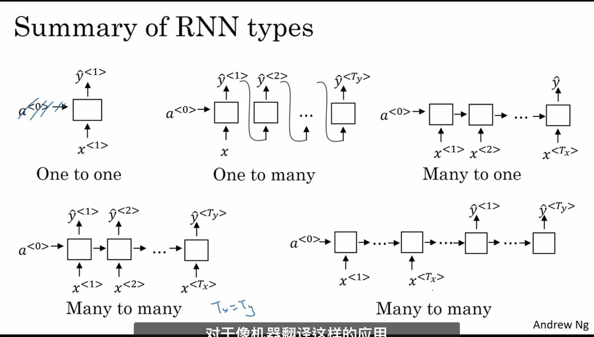
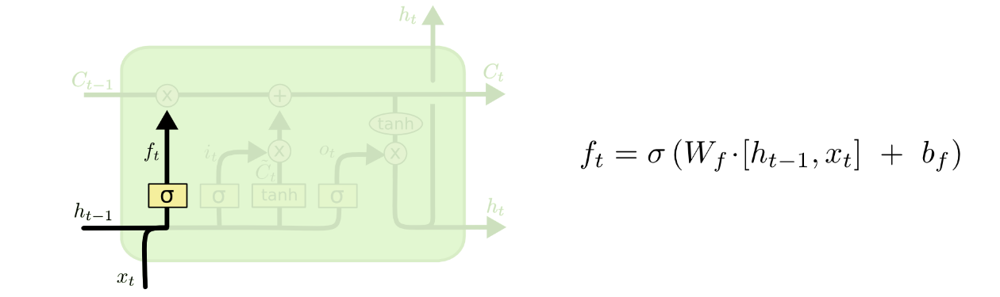

## 词的表示

  vocabulary，建立一个词表，每个词对应一个数字，也可以用one hot编码表示（内存堪忧）(每个词都是孤立的，对相关词的泛化能力不强)

## 循环神经网络

 ### RNN

 其实就是单层的线性，重复计算，当前输入和之前的$a_{t-1}$经过线性+激活之后输出$a_{t}$给下一个，同时再经过一个激活输出y。一对一，多对一可以控制输出个数，在最后一个才输出。一对多就可以把之前的输出当成现在的输入。而多对多则可以分成两个模块，编码器（输入进来）和解码器（负责输出）。
  多输入多输出第二种也称为编码-解码架构

  

### LSTM长短期记忆网络

分为三个模块，分别是遗忘门，输入门和输出门

遗忘门负责控制之前的记忆$c_{t-1}$保留进现在的记忆的程度，把输入$h_{t-1}$和$x_{t}$一起经过一个线性+sigmoid层，变成一个零到一之间的数，表示对记忆的保留程度，越接近1则保留的越多。

输入门则是把当前的信息输入进记忆里面。把$h_{t-1}$和$x_t$一起分别经过线性+sigmoid和线性+tanh层，然后进行相乘并加进记忆里面，这就形成了现在的记忆$C_t$。

输出门则是把$h_{t-1}$和$x_t$经过线性+sigmoid层，再把现在的记忆$C_t$经过tanh（注意此处没有线性层）层，把两者相乘就形成了现在的输出$h_t$。

循环以上网络则是LSTM

### GRU

GRU是LSTM的变种，计算如上，总体来说比LSTM简单。GRU只有两个门，更新门和重置门，GRU直接将hidden state 传给下一个单元，而LSTM用memory cell 把hidden state 包装起来。

### 双向循环神经网络BRNN

输出由两个循环神经网络组成，一个从前计算到后，一个从后计算到前，两者输出相加即可。

### 深度循环神经网络

​	多个RNN连接一起即可。

## 词嵌入word embeddings

可以让计算机理解一些词的对应关系。传统的onehot编码仅仅只是将词符号化，无法表达出词之间的关系。

如图每个单词都是多维向量，可以通过向量之间的距离来判断词义是否相近。如-1为男性，1为女性，而0则是无关。而且one-hot如果有一万个单词，则每个单词都是一万维的，但词嵌入的维度只有特征个数，如他有300个特征，那就只有300维。（没有考虑多义词，窗口长度有限）

Word2Vec有两种训练方法，一种叫CBOW，核心思想是从一个句子里面把一个词抠掉，用这个词的上文和下文去预测被抠掉的这个词；
第二种叫做Skip-gram，和CBOW正好反过来，输入某个单词，要求网络预测它的上下文单词。

从Word Embedding到ELMO
Embedding from Language Models
Word Embedding本质上是个静态的方式，所谓静态指的是训练好之后每个单词的表达就固定住了，以后使用的时候，不论新句子上下文单词是什么，这个单词的Word Embedding不会跟着上下文场景的变化而改变，所以对于比如Bank这个词，它事先学好的Word Embedding中混合了几种语义 ，在应用中来了个新句子，即使从上下文中（比如句子包含money等词）明显可以看出它代表的是“银行”的含义，但是对应的Word Embedding内容也不会变，它还是混合了多种语义。这是为何说它是静态的，这也是问题所在。

ELMO的本质思想是：我事先用语言模型学好一个单词的Word Embedding，此时多义词无法区分，不过这没关系。在我实际使用Word Embedding的时候，单词已经具备了特定的上下文了，这个时候我可以根据上下文单词的语义去调整单词的Word Embedding表示，这样经过调整后的Word Embedding更能表达在这个上下文中的具体含义，自然也就解决了多义词的问题了。

## seq2seq

  即上述RNN中的多输入对多输出（第二种）。

### seq2seq with attention

  Attention 模型的特点是 Encoder 不再将整个输入序列编码为固定长度的「中间向量Ｃ」，而是编码成一个向量的序列(包含多个向量)。引入了Attention的Encoder-Decoder 模型如下图：

  

  **从输出的角度讲**
  	每个输出的词Y会受到每个输入X的整体影响，不是只受某一个词的影响，毕竟整个输入语句是整体而连贯的，但同时每个输入词对每个输出的影响又是不一样的，即每个输出Y受输入X的影响权重不一样，而这个权重便是由Attention计算，也就是所谓的注意力分配系数，计算每一项输入对输出权重的影响大小
  **从编码的角度讲**
  	在根据给到的信息进行编码时（或称特征提取），不同信息的重要程度是不一样的（可用权重表示），即有些信息是无关紧要的，比如一些语气助词之类的，所以这个时候在编码时，就可以有的放矢，根据不同的重要程度针对性汲取相关信息
  **总结：通过计算相似性得出权重最后加权求和**

  

  

  第一步：代表漫威漫画的query 和 代表某本书的key 进行相似度计算（常见的方法包括：求两者的向量点积、求两者的向量Cosine相似性等），得到权值
  第二步：将权值进行归一化（将原始计算分值整理成所有元素权重之和为1的概率分布，或者说通过SoftMax的内在机制更加突出重要元素的权重），得到直接可用的权重
  第三步：将权重和 value 进行加权求和、

  此为attention基本思想

## transformer

  

###   **注意力**

  计算自注意力有两种方式：一种通过向量，一种通过矩阵。

  ​	**第一步：生成查询向量、键向量和值向量**

  **向量**

  ​	把输入的向量分别乘以三个不同的权重矩阵$W^Q,W^K,W^V$，得到Q、K、V，而这些权重矩阵是在模型训练阶段中训练出来的对于权重矩阵$W^Q,W^K,W^V$如何训练出来的，还是标准老套路：先随机初始化，然后在损失函数中表示出来，最后通过反向传播不断优化学习得出，最终目标是最小化模型的预测误差。

  

  ​	查询向量Query是当前单词的表示形式，用于对所有其他单词(key)进行评分，我们只需要关注当前正在处理的token的query
  ​	键向量Key可以看做是序列中所有单词的标签，是在我们找相关单词时候的对照物
  ​	值向量Value是单词的实际表示，一旦我们对每个单词的相关度打分之后，我们就要对value进行相加表示当前正在处理单词的value

  ​	**第二步：计算得分**

  ​	这个得分通过“Thinking”所对应的查询向量query和所有词的键向量key，依次乘积得出来。所以如果我们是处理位置最靠前的词的attention分值的话

  第一个分数是$q1$和$k1$的点积(根据点积结果可以判断$q1$和$k1$这个向量的相似性)
  第二个分数是$q1$和$k2$的点积(根据点积结果可以判断$q1$和$k2$这个向量的相似性)

  

  ​	**第三、四步：分数除以8然后softmax**

  ​	将分数除以8（8是论文中使用的键向量的维数64的平方根，这会让梯度更稳定，也可以使用其它值）
  然后通过softmax传递结果，softmax的作用是使所有单词的分数归一化，得到的分数都是正值且它们的和为1

  ​	这个softmax分数决定了在编码当下位置（“Thinking”）时，包括当下位置单词（“Thinking”）在内每个单词的所获得的关注度。显然，正在当下位置上的Thinking获得最高的softmax分数

  ​	**第五、六步：值向量乘以softmax分数后对加权值向量求和**
  ​	第五步是将softmax分值乘以每个值向量，这样操作的意义在于留下我们想要关注的单词的value，并把其他不相关的单词丢掉(例如，让它们乘以0.001这样的小数)

  ​	第六步是对加权值向量求和，产生“Thinking”的self-attention的输出结果

  **推广到矩阵**

  第一步是计算查询矩阵、键矩阵和值矩阵。为此，我们将输入词向量合并成输入矩阵（矩阵的每一行代表输入句子中的一个单词，所以整个矩阵就代表整个句子)，将其乘以我们训练的权重矩阵：$W^Q,W^K,W^V$

  

  最后，由于我们处理的是矩阵，我们可以将步骤2到步骤6合并为一个公式来计算自注意力层的输出

  

  其中$d_k$为词嵌入的维度

### 多头注意力机制

  ​	它扩展了模型专注于不同位置的能力。编码“Thinking”的时候，虽然最后Z1或多或少包含了其他位置单词的信息，但是它实际编码中把过多的注意力放在“Thinking”单词本身(当然了，这也无可厚非，毕竟自己与自己最相似嘛)
  且如果我们翻译一个句子，比如“The animal didn’t cross the street because it was too tired”，我们会想知道“it”和哪几个词都最有关联，这时模型的“多头”注意机制会起到作用
  ​	它给出了注意力层的多个“表示子空间”（representation subspaces）

  可以类比CNN中同时使用多个滤波器的作用，直观上讲，多头的注意力有助于网络捕捉到更丰富的特征/信息

  

  ​	**对比其他**

  CNN：通过更多的卷积操作，把卷积网络堆叠的更深，以此来让它有机会捕捉“长距离依赖”。换言之，卷积网络主要依靠深度来捕捉长距离依赖。但这个过程太间接了，因为信息在网络中实际传播了太多层。究竟哪些信息被保留，哪些被丢弃了，弄不清楚。所以从实践经验来看，卷积网络捕捉长依赖的能力非常弱。这也是为什么在大多数需要长依赖关系建模的场景中，CNN用的并不多的原因

  

  

  RNN：

  RNN意味着中包含最多的信息是当前的输入，越往前的输入，随着距离的增加，信息衰减得越多。对于每一个输出隐向量都是如此，包含信息最多得是当前的输入，随着距离拉远，包含前面输入的信息越来越少
  但是Transformer这个结构就不存在这个问题，不管当前词和其他词的空间距离有多远，包含其他词的信息不取决于距离，而是取决于两者的相关性，这是Transformer的第一个优势
  第二个优势在于，对于Transformer来说，在对当前词进行计算的时候，不仅可以用到前面的词，也可以用到后面的词，而RNN只能用到前面的词(当然，这倒不是个有多严重的问题，因为这可以通过双向RNN来解决)
  第三点，RNN是一个顺序的结构，必须要一步一步地计算，只有计算出，才能计算，其次再计算，即隐向量无法同时并行计算，导致RNN的计算效率不高

### **Norm**

多头注意力之后有一个Norm，这里是layerNorm

#### **BatchNorm**：

上图画的是一个batch_size为N的图像特征张量。

BatchNorm把一个batch中同一通道的所有特征（如上图红色区域）视为一个分布（有几个通道就有几个分布），并将其标准化。这意味着:
不同图片的的同一通道的相对关系是保留的，即不同图片的同一通达的特征是可以比较的
同一图片的不同通道的特征则是失去了可比性
有一些可解释性方面的观点认为，feature的每个通道都对应一种特征（如低维特征的颜色，纹理，亮度等，高维特征的人眼，鸟嘴特征等）。BatchNorm后不同图片的同一通道的特征是可比较的，或者说A图片的纹理特征和B图片的纹理特征是可比较的；而同一图片的不同特征则是失去了可比性，或者说A图片的纹理特征和亮度特征不可比较。
这其实是很好理解的，视觉的特征是比较客观的，一张图片是否有人跟一张图片是否有狗这两种特征是独立，即同一图片的不同特征是不需要可比性；而人这种特征模式的定义其实是网络通过比较很多有人的图片，没人的图片得出的，因此不同图片的同一特征需要具有可比性。

#### **LayerNorm**：

上图画的是一个N个句子的语义特征张量。

如上图LayerNorm把一个样本的所有词义向量视为一个分布（有几个句子就有几个分布），并将其标准化。这意味着:
同一句子中词义向量（上图中的V1, V2, …, VL）的相对大小是保留的，或者也可以说LayerNorm不改变词义向量的方向，只改变它的模。
不同句子的词义向量则是失去了可比性。
考虑两个句子，“教练，我想打篮球！” 和 “老板，我要一打包子。”。通过比较两个句子中 “打” 的词义我们可以发现，词义并非客观存在的，而是由上下文的语义决定的。
因此进行标准化时不应该破坏同一句子中不同词义向量的可比性，而LayerNorm是满足这一点的，BatchNorm则是不满足这一点的。且不同句子的词义特征也不应具有可比性，LayerNorm也是能够把不同句子间的可比性消除

### **标准位置编码**

  Transformer却完全把时序信息给丢掉了，比如“他欠我100万”，和“我欠他100万”，两者的意思千差万别，故为了解决时序的问题，Transformer的作者用了一个绝妙的办法：位置编码(Positional Encoding)

  即将每个位置编号，从而每个编号对应一个向量，最终通过结合位置向量和词向量，作为输入embedding，就给每个词都引入了一定的位置信息，这样Attention就可以分辨出不同位置的词了，具体怎么做呢？

  1. 如果简单粗暴的话，直接给每个向量分配一个数字，比如1到1000之间
  2. 也可以用one-hot编码表示位置

  3. transformer论文中作者通过sin函数和cos函数交替来创建 positional encoding，其计算positional encoding的公式如下

  

  ​	其中，pos相当于是每个token在整个序列中的位置，相当于是0, 1, 2, 3...(看序列长度是多大，比如10，比如100)，代表位置向量的维度(也是词embedding的维度，transformer论文中设置的512维) 
  ​	至于i是embedding向量的位置下标对2求商并取整(可用双斜杠表示整数除法，即求商并取整)，它的取值范围是，

###    **求和与归一化、线性层和softmax层**

  编码器详细架构：

  

  

###  **解码器**

  有两个编码和解码的Transformer如下

  

  解码器中有两个注意力层

  一个带masked的Multi-Head Attention，本质是Self-Attention
  该自注意力层只允许关注已输出位置的信息，实现方法是在自注意力层的softmax之前进行mask，将未输出位置的权重设置为一个非常大的负数(进一步softmax之后基本变为0，相当于直接屏蔽了未输出位置的信息
  一个不带masked的Multi-Head Attention，本质是Encoder-Decoder Attention（注意其输入只有Q是来自上一个注意力，其他都是来自编码器的最后一层）

  比如当我们要把“Hello World”翻译为“你好，世界”时
  编码器是针对：Hello World
  解码器是针对：你好 世界

  Decoder会计算“你好”这个query分别与“Hello”、“World”这两个key的相似度
  很明显，“你好”与“Hello”更相似，从而给“Hello”更大的权重，最终把“你好”对应到“Hello”，达到的效果就是“Hello”翻译为“你好”  

###   **最后的线性层和softmax层**

  就正常的线性+softmax分类，最后的维度就是词汇表的长度。

  

  

  

  

  

  

  

  

  

## 预训练

  

我们设计好网络结构以后，对于图像来说一般是CNN的多层叠加网络结构，可以先用某个训练集合比如训练集合A或者训练集合B对这个网络进行预先训练，在A任务上或者B任务上学会网络参数，然后存起来以备后用。假设我们面临第三个任务C，网络结构采取相同的网络结构，在比较浅的几层CNN结构，网络参数初始化的时候可以加载A任务或者B任务学习好的参数，其它CNN高层参数仍然随机初始化。

之后我们用C任务的训练数据来训练网络，此时有两种做法：
	一种是浅层加载的参数在训练C任务过程中不动，这种方法被称为“Frozen”;
	另外一种是底层网络参数尽管被初始化了，在C任务训练过程中仍然随着训练的进程不断改变，这种一般叫“Fine-Tuning”，顾名思义，就是更好地把参数进行调整使得更适应当前的C任务。

一般图像或者视频领域要做预训练一般都这么做。这么做有几个好处，首先，如果手头任务C的训练集合数据量较少的话，现阶段的好用的CNN比如Resnet/Densenet/Inception等网络结构层数很深，几百万上千万参数量算起步价，上亿参数的也很常见，训练数据少很难很好地训练这么复杂的网络，但是如果其中大量参数通过大的训练集合比如ImageNet预先训练好直接拿来初始化大部分网络结构参数，然后再用C任务手头比较可怜的数据量上Fine-tuning过程去调整参数让它们更适合解决C任务，那事情就好办多了。

Fine-Tuning例子：

假设我们想从图像中识别出不同种类的椅子，然后将购买链接推荐给用户。一种可能的方法是

先找出100种常见的椅子，为每种椅子拍摄1,000张不同角度的图像，然后在收集到的10万张图像数据集上训练一个分类模型
这个椅子数据集虽然可能比一般的小数据集要庞大，但样本数仍然不及ImageNet数据集中样本数的十分之一
所以如果把适用于ImageNet数据集的复杂模型用在这个椅子数据集上便会过拟合。同时，因为椅子数据量有限，最终训练得到的模型的精度也可能达不到实用的要求
比较经济的解决办法便是应用迁移学习，将从ImageNet数据集学到的知识迁移到椅子数据集上
毕竟虽然ImageNet数据集的图像大多跟椅子无关，但在该数据集上训练的模型可以抽取较通用的图像特征，从而能够帮助识别边缘、纹理、形状和物体组成等，这些类似的特征对于识别椅子也同样有效。

## **从Word Embedding到GPT**
GPT是“Generative Pre-Training”的简称，从名字看其含义是指的生成式的预训练。

GPT也采用两阶段过程，第一个阶段是利用语言模型进行预训练，第二阶段通过Fine-tuning的模式解决下游任

GPT的预训练过程，其实和ELMO是类似的，主要不同在于两点：

1. 首先，特征抽取器不是用的LSTM，而是用的Transformer，毕竟它的特征抽取能力要强于LSTM，这个选择很明显是很明智的；
2. 其次，GPT的预训练虽然仍然是以语言模型作为目标任务，但是采用的是单向的语言模型

GPT使用的Transformer结构就是将Encoder中的Self-Attention替换成了Masked Self-Attention，从而每个位置的词看不到后面的词

## **双向Transformer版的GPT—bert**

要訓練好一個有 1.1 億參數的 12 層 **BERT-BASE** 得用 16 個 [TPU chips](https://cloudplatform.googleblog.com/2018/06/Cloud-TPU-now-offers-preemptible-pricing-and-global-availability.html) 跑上整整 4 天，花費 500 鎂；24 層的 **BERT-LARGE** 則有 3.4 億個參數，得用 64 個 TPU chips（約 7000 鎂）訓練。喔對，別忘了多次實驗得把這些成本乘上幾倍。[最近也有 NLP 研究者呼籲大家把訓練好的模型開源釋出](https://twitter.com/arnicas/status/1147426600180494337?s=20)以減少重複訓練對環境造成的影響。哈人

Google 在預訓練 BERT 時讓它**同時**進行兩個任務：

- 克漏字填空（[1953 年被提出的 Cloze task](https://journals.sagepub.com/doi/abs/10.1177/107769905303000401)，學術點的說法是 **M**asked **L**anguage **M**odel, MLM）

	80%的时间是采用[mask]，my dog is hairy → my dog is [MASK]
	10%的时间是随机取一个词来代替mask的词，my dog is hairy -> my dog is apple
	10%的时间保持不变，my dog is hairy -> my dog is hairy

- 判斷第 2 個句子在原始文本中是否跟第 1 個句子相接（**N**ext **S**entence **P**rediction, NSP）

为何要这么麻烦？这是因为transformer要保持对每个输入token分布式的表征，否则Transformer很可能会记住这个[MASK]就是"hairy"（强行记住了位置和masked的分布，而没有真正理解上下文），从而导致若训练样本和微调的样本mask不一致的情况下，模型预测出现很大的偏差。如果仅使用[MASK]或者随机的词，那么模型可能学习到的信息都是错误的单词（认为这个地方的单词就是不正确的）；
若仅使用正确的单词，那么模型学到的方法就是直接copy（根据学到的上下文，直接断定），从而学不到完整的上下文信息。

除了一般的 wordpieces 以外，BERT 裡頭有 5 個特殊 tokens 各司其職：

- `[CLS]`：在做分類任務時其最後一層的 repr. 會被視為整個輸入序列的 repr.
- `[SEP]`：有兩個句子的文本會被串接成一個輸入序列，並在兩句之間插入這個 token 以做區隔
- `[UNK]`：沒出現在 BERT 字典裡頭的字會被這個 token 取代
- `[PAD]`：zero padding 遮罩，將長度不一的輸入序列補齊方便做 batch 運算
- `[MASK]`：未知遮罩，僅在預訓練階段會用到

而关于bert原论文中的编码部分

token embedding ：将各个词转换成固定维度的向量。在BERT中，每个词会被转换成768维的向量表示。在实际代码实现中，输入文本在送入token embeddings 层之前要先进行tokenization处理。此外，两个特殊的token会被插入到tokenization的结果的开头 ([CLS])和结尾 ([SEP])
segment embedding： 用于区分一个token属于句子对中的哪个句子。Segment Embeddings 层只有两种向量表示。前一个向量是把0赋给第一个句子中的各个token, 后一个向量是把1赋给第二个句子中的各个token。如果输入仅仅只有一个句子，那么它的segment embedding就是全0 。
position embedding：Transformers无法编码输入的序列的顺序性，所以要在各个位置上学习一个向量表示来将序列顺序的信息编码进来。加入position embeddings会让BERT理解下面下面这种情况，“ I think, therefore I am ”，第一个 “I” 和第二个 “I”应该有着不同的向量表示。

如何将文本转换成适合bert输入的格式？

   我們需要將原始文本轉換成 **3 種 id tensors**：

- `tokens_tensor`：代表識別每個 token 的索引值，用 tokenizer 轉換即可
- `segments_tensor`：用來識別句子界限。第一句為 0，第二句則為 1。另外注意句子間的 `[SEP]` 為 0
- `masks_tensor`：用來界定自注意力機制範圍。1 讓 BERT 關注該位置，0 則代表是 padding 不需關注

論文裡的例子並沒有說明 `[PAD]` token，但實務上每個 batch 裡頭的輸入序列長短不一，為了讓 GPU 平行運算我們需要將 batch 裡的每個輸入序列都補上 zero padding 以保證它們長度一致。另外 `masks_tensor` 以及 `segments_tensor` 在 `[PAD]` 對應位置的值也都是 0，切記切記。

## **自回归模型与自编码模型**

1. AR模型，auto regressive，自回归模型。 自回归模型可以类比为早期的统计语言模型（Statistical Language Model），也就是根据上文预测下一个单词，或者根据下文预测前面的单词，只能考虑单侧信息，典型的如GPT，而ELMo 是将两个方向（从左至右和从右至左）的自回归模型进行了拼接，实现了双向语言模型，但本质上仍然属于自回归模型。
2. AE模型，auto encoding，自编码模型。 从损坏的输入数据（相当于加入噪声）中预测重建原始数据，可以使用上下文的信息。BERT使用的就是AE。劣势是在下游的微调阶段不会出现掩码词，因此[MASK] 标记会导致预训练和微调阶段不一致的问题。

## **GELU激活函数**

这里$Φ ( x )$是正太分布的概率函数，可以简单采用正太分布$N ( 0 , 1 )$,

对于假设为标准正太分布的G E L U ( x ) GELU(x)GELU(x), 论文中提供了近似计算的数学公式，如下：

## 从gpt到chatgpt

### gpt1

GPT-1的核心是Transformer

1）通过无监督训练，解决需要大量高质量标注数据的问题，降低数据成本。

2）通过大量不同类型混杂语料进行预训练，解决训练任务的泛化问题。

GPT-1 是一个自回归语言模型，只具有解码器模块。GPT-1模型使用 768大小词嵌入。使用 12 层模型，每个自注意力层有 12 个注意力头，并使用GELU 作为激活函数。

### **GPT-2与Zero-shot Learning**

GPT-2 有 15 亿个（1.5B）参数。是 GPT-1（117M 参数）的 10 倍以上。

GPT-2与 GPT-1 的主要区别包括：

1）GPT-2 有 48 层，使用 1600 维向量进行词嵌入，使用了 50,257 维标记的更大词汇量。

使用1024大小的上下文窗口。

2）GPT-2的层归一化被移动到每个子块的输入，并在最终的自注意力块之后添加了一个额外的层进行归一化。

3）GPT-2在初始化时，残差层的权重按 1/√N 缩放，其中 N 是残差层的数量。

### GPT-3

GPT-3实际上是由多个版本组成的**第3代家族**，具有不同数量的参数和所需的计算资源。

由于使用了大量参数和广泛的数据集， GPT-3在零样本和少样本设置中的下游 NLP 任务上表现良好

#### 上下文学习In-context Learning（ICL）

In Context Learning（ICL）的关键思想是从类比中学习。下图给出了一个描述语言模型如何使用 ICL 进行决策的例子。首先，ICL 需要一些示例来形成一个演示上下文。这些示例通常是用自然语言模板编写的。然后 ICL 将查询的问题（即你需要预测标签的 input）和一个上下文演示（一些相关的 cases）连接在一起，形成带有提示的输入，并将其输入到语言模型中进行预测。

值得注意的是，与需要使用反向梯度更新模型参数的训练阶段的监督学习不同，**ICL 不需要参数更新，并直接对预先训练好的语言模型进行预测（这是与 prompt，传统 demonstration learning 不同的地方，ICL 不需要在下游 P-tuning 或 Fine-tuning）**。我们希望该模型学习隐藏在演示中的模式，并据此做出正确的预测。（直接提供例子然后进行判断，不需要微调）

