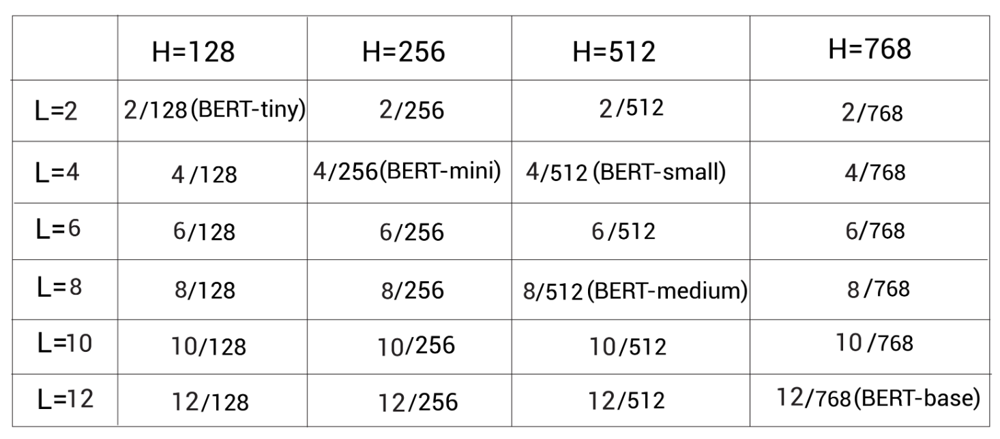
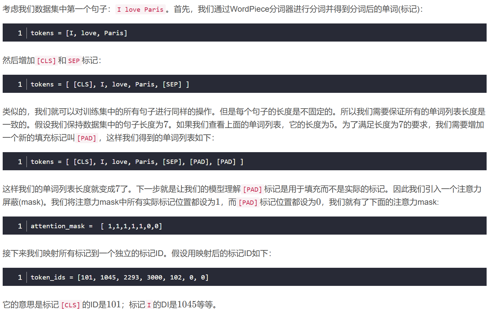
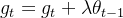
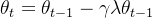

Google开源了预训练的BERT模型，我们可以从https://github.com/google-research/bert中下载。他们开源了多种配置，如下图所示。L 代表编码器层数，H代表隐藏单元大小

 BERT-uncased	所有标记都是小写。 BERT-cased	区分大小写

**Adam和AdamW的区别**

AdamW和Adam唯一的区别，就是weight decay的加入方式。

在Adam当中，weight decay是直接加入到梯度当中：

其中是当前step的梯度，是上一个step中的模型权重，是正则化系数。

而在AdamW中，正则化变成了：

其中是学习率。

所以AdamW的思路特别简单：反正正则化系数加进梯度之后最终也要在权重上进行更新，那为什么还需要加进梯度去呢？因此，AdamW直接在权重上进行衰减，在收敛速度上也能领先于Adam。

**有关数据采样**

在训练集和验证集的数据加载过程中,使用不同的采样方式是有特定的考虑因素的:

训练集采用随机采样(RandomSampler):
目的是为了增加模型训练的多样性和泛化能力。
随机采样可以打乱训练数据的顺序,避免模型在训练过程中过拟合某些特定顺序的数据。
这有助于模型学习到更加稳健和泛化性强的特征表示。
验证集采用顺序采样(SequentialSampler):
验证集的目的是评估模型在训练外数据上的性能。
使用顺序采样可以确保验证集的数据顺序是固定的,这样可以更好地比较不同训练轮次或不同模型的性能指标。
如果采用随机采样,每次验证时得到的指标可能会有一定的波动,不利于模型选择和超参数调优。