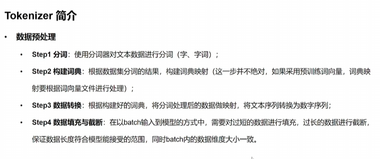

# Transformers库

## pipeline

读取模型

```python
from transformers import pipeline


pipe = pipeline("text-classification", model="cardiffnlp/twitter-roberta-base-sentiment-latest", device=0)

print(pipe)
print(pipe("it is bad for me"))

print(1)
```

model可以上hugging face上面找。里面有每个模型的简介。


## Tokenizer

数据预处理：分词，构建词典，数据转换，数据填充与截断

